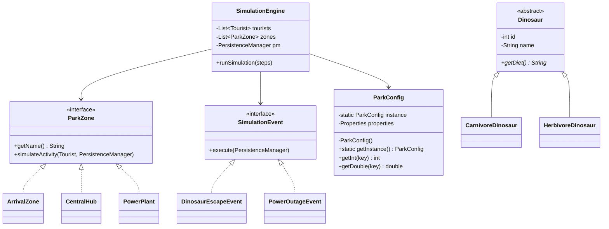
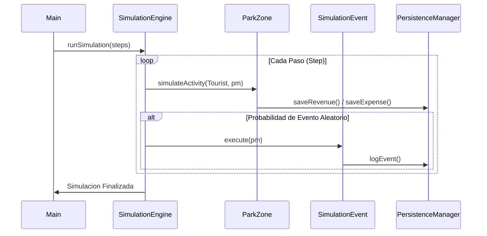

# Sistema de Simulación: Dinosaur Park

Este proyecto consiste en un simulador de backend desarrollado en Java 17 para la gestión operativa de un parque temático de dinosaurios. El sistema integra conceptos de programación orientada a objetos, patrones de diseño y un sistema de persistencia de datos simulado mediante archivos externos.

## Diseño de Arquitectura (UML)

Se han definido los siguientes diagramas para representar la estructura técnica y el flujo lógico del sistema:

### 1. Diagrama de Clases (Estructura del Proyecto)
Este diagrama detalla la jerarquía de herencia de las entidades, la implementación de interfaces para las zonas del parque y la aplicación de los patrones de diseño.

## 2. Diagrama de Secuencia (Logica de la Simulacion)

Representa la interacción entre los objetos durante la ejecucion de un ciclo o
paso de la simulacion.

### Especificaciones Tecnicas

- Lenguaje: Java 17 (Amazon Corretto).
- Gestion de Proyectos: Maven.
- Pruebas Unitarias: JUnit 5.
- Cobertura de Codigo: JaCoCo (Logrado: 80.5%).
- Persistencia: Archivos planos en formato CSV.
- Patrones de Diseno: Singleton y Strategy.

### Funcionalidades del Sistema

- Gestion de Turistas: Registro de visitantes y seguimiento de su flujo
  financiero dentro del parque.
- Zonas Operativas:
    - ArrivalZone: Gestion de acceso y venta de boletos.
    - CentralHub: Punto de distribucion y venta de souvenirs.
    - PowerPlant: Suministro de energia y generacion de costos operativos.
- Eventos Dinamicos: Simulacion de incidentes (escapes, fallas electricas)
  gestionados de forma aleatoria.
- Monitoreo: Sistema de reporte final que entrega un balance de ingresos
  frente a gastos operativos.
- Configuracion Externa: Uso del archivo park.properties para parametrizar el
  comportamiento del sistema sin alterar el codigo fuente.

### Aplicacion de Patrones de Diseno

- Singleton: Implementado en la clase ParkConfig para garantizar que la
  configuracion se cargue una sola vez, centralizando el acceso a los datos.
- Strategy: Implementado a traves de la interfaz SimulationEvent, permitiendo
  que el motor de simulacion ejecute diferentes tipos de eventos sin conocer
  su implementacion interna.

### Calidad y Pruebas Unitarias

El proyecto ha sido sometido a un riguroso proceso de validacion mediante
pruebas unitarias:

- Cobertura lograda: 80.5% de las líneas de codigo.
- Paquetes validados: model, zone, event, simulation, config, monitoring y
  persistence.
- Ejecucion: Las pruebas pueden ejecutarse desde el IDE o mediante Maven,
  asegurando que el flujo determinista y las reglas de negocio se cumplan.

### Persistencia de Datos

El sistema utiliza una arquitectura de persistencia basada en archivos CSV para
el monitoreo de actividades:

- ingresos.csv: Registro detallado de entradas y ventas de servicios.
- gastos.csv: Bitácora de costos por mantenimiento y energía.
- eventos.csv: Historial de incidencias y eventos aleatorios ocurridos.

Desarrollado por: Manuel Diego Santiago
Laboratorio 360 Bloque 4 - Formación Java y Spring
Boot

